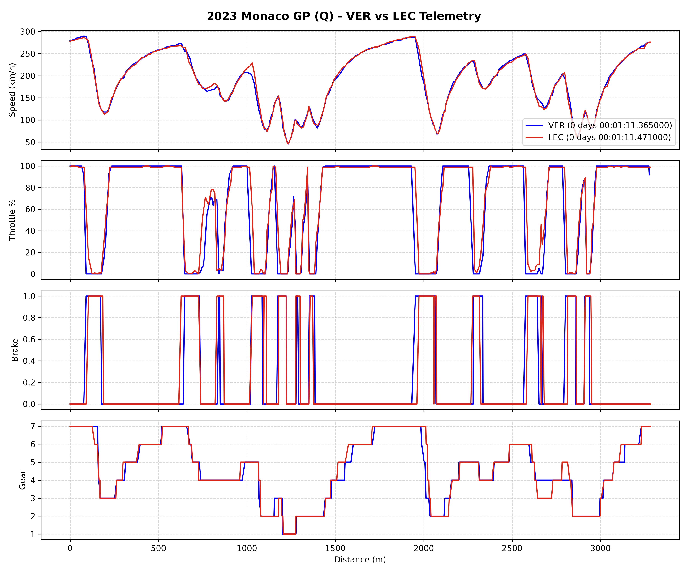
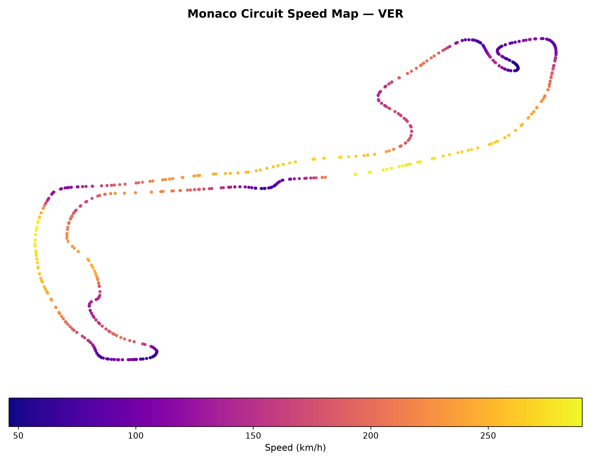

# 🏎️ F1 Telemetry & Speed Profile Plotter

A Python tool that fetches high-frequency Formula 1 telemetry data using the `FastF1` API to generate side-by-side driver comparisons and speed-profile circuit maps.




## Features
- **Lap Telemetry Traces:** Side-by-side comparison of Speed, Throttle %, Brake pressure, and Gear usage along lap distance.
- **2D Track Map:** Renders the circuit layout using GPS $X,Y$ coordinates with a continuous speed heatmap (`plasma` colormap).
- **Fast Local Caching:** Leverages FastF1 caching to minimize API fetch times on repeated runs.

## Setup & Running

1. **Clone the repository:**
   ```bash
   git clone git@github.com:YOUR_USERNAME/f1-telemetry-plotter.git
   cd f1-telemetry-plotter
   ```
2. **Set up virtual environment & install requirements:**
   ```bash
    python -m venv venv
    source venv/bin/activate
    pip install -r requirements.txt
   ```
3. **Run the plotter:**
   ```bash
    python f1_plotter.py
   ```

